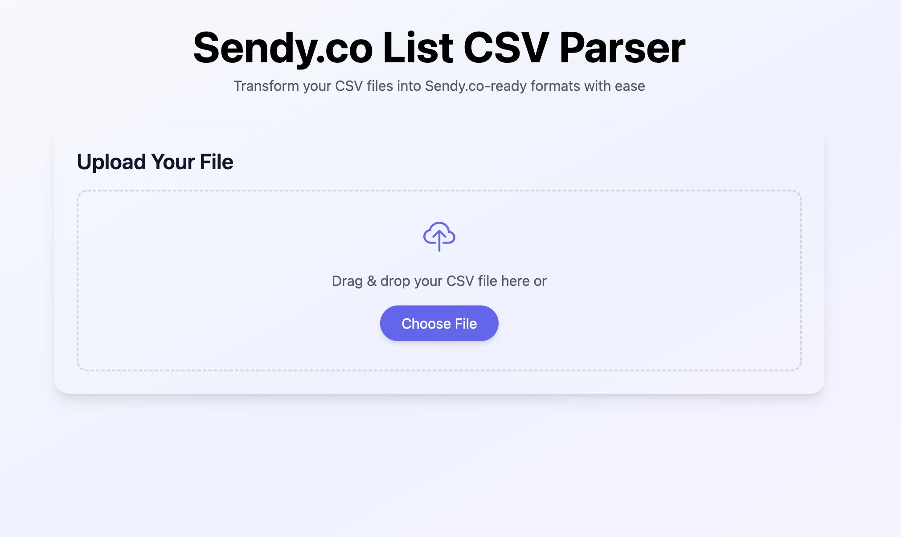

Welcome to CSV2Sendy's documentation!
==================================

CSV2Sendy is a powerful CSV processor for Sendy.co with Brazilian data format support.
It helps you process CSV files containing contact information and format them according
to Sendy.co's requirements, with special handling for Brazilian data formats.

Features
--------

- Advanced Brazilian data format support
  - Smart name processing (handles 'sem nome' case)
  - Robust phone number formatting with DDD support
  - Brazilian address formatting
- Phone number processing
  - International format (+55 prefix)
  - DDD (area code) validation
  - Mobile and landline number support
  - Automatic format detection
- Email handling
  - Strict email validation
  - Email normalization
  - Duplicate removal
- Web interface
  - File upload with multiple encoding support
  - Interactive column mapping
  - Tag management
  - Preview and download
- Data transformation
  - Flexible column mapping
  - Custom tag addition
  - Data validation and cleaning
  - UTF-8 encoding support

Contents
--------

.. toctree::
   :maxdepth: 2
   :caption: Contents:

   installation
   usage
   api
   contributing
   changelog

Installation
------------

You can install CSV2Sendy using pip:

.. code-block:: bash

   pip install csv2sendy

Requirements
-----------

Core dependencies:

- Python >=3.9
- pandas >=1.3.0
- email-validator >=1.1.0
- flask >=2.0.0
- werkzeug >=2.0.0

Development dependencies (install with ``.[dev]``):

- pytest >=7.0.0
- pytest-cov >=4.0.0
- mypy >=1.13.0
- types-flask >=1.1.0
- types-werkzeug >=1.0.0
- pandas-stubs >=2.0.0

Documentation dependencies (install with ``.[docs]``):

- sphinx >=7.0.0

Quick Start
----------

Here's a simple example of how to use CSV2Sendy:

.. code-block:: python

   from csv2sendy.core import CSVProcessor

   # Create a processor instance
   processor = CSVProcessor()

   # Process a CSV file
   result = processor.process_file('contacts.csv')

   # Save the processed data
   result.to_csv('processed_contacts.csv', index=False)

Web Interface
------------

CSV2Sendy provides an intuitive web interface for easy file processing:

To start the web interface:

.. code-block:: bash

   # Start the web server
   python -m csv2sendy.web.app

Then open your browser and navigate to http://localhost:5000

The web interface provides:

- Drag & drop file upload
- Automatic CSV processing
- Interactive column mapping
- Data validation and cleaning
- Preview and download capabilities

Contributing
-----------

We welcome contributions! Please check our `Contributing Guide <contributing.html>`_ for details on how to:

- Report bugs
- Suggest features
- Submit pull requests
- Run tests
- Update documentation

License
-------

CSV2Sendy is open source software licensed under the MIT license.

Indices and tables
==================

* :ref:`genindex`
* :ref:`modindex`
* :ref:`search`
